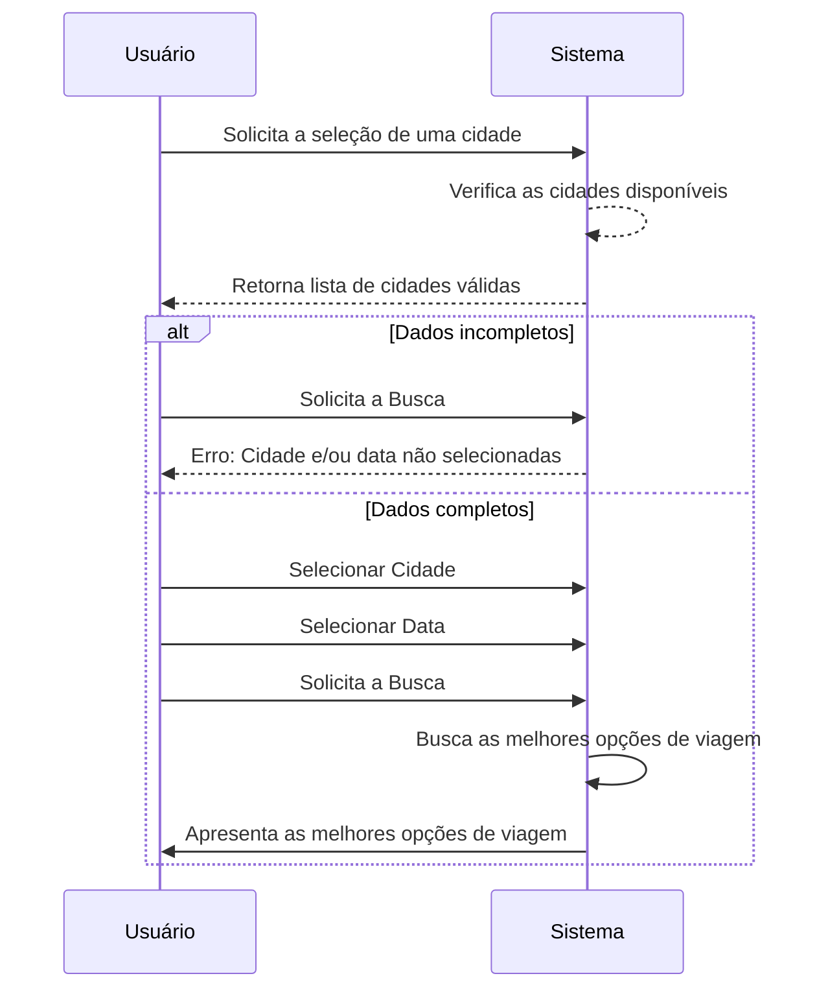

# Resultado - Desafio CoorLab

## Introdução
Este repositório foi desenvolvido como parte do Desafio CoorLab, um projeto para avaliar minhas habilidades em desenvolvimento web usando Vue.js para o frontend e Python para o backend.

## Sobre
O projeto envolve a criação de um sistema no qual usuários podem buscar viagens e comparar preços entre a opção mais confortável e rápida e a mais econômica. O projeto utiliza uma API REST que fornece dados estruturados para as cotações de viagem.

## Uso
Para usar o sistema, entre no diretório [app](./app/) e execute o script [run.sh](./app/run.sh) em um terminal com bash. Esse script instalará as dependencias e inicializará o projeto. O projeto pode ser acessado em [localhost:8080](http://localhost:8080/).

### Diagrama de sequência do caso de uso principal
O seguinte diagrama de sequência descreve o caso de uso principal do sistema:

## Tecnologias Utilizadas
- [Django](https://www.djangoproject.com/) - Django é uma framework web Python de alto nível que incentiva o desenvolvimento rápido e um design limpo e pragmático. Foi escolhido o uso de Django neste projeto para contribuir ao aprendizado de uma nova framework, para permitir uma implementação rápida e eficiente da solução, pela sua ótima documentação e recursos online e por ser uma tecnologia utilizada pela Coorlab.
- [Quasar Framework](https://quasar.dev/) - O Quasar Framework é uma estrutura de código aberto baseada em Vue.js, que permite o desenvolvimento rápido de aplicativos web, móveis e desktop com uma única base de código. Ele oferece uma variedade de componentes Vue predefinidos, um sistema de layout responsivo e suporte integrado para PWA (Progressive Web Apps) e SSR (Server-Side Rendering). O Quasar foi escolhido para este projeto por facilitar uma implementação veloz das interfaces com seus componentes predefinidos e por minha familiaridade e experiência profissional com a tecnologia.
- [SQLite](https://www.sqlite.org/) - "O SQLite é um sistema de banco de dados relacional leve, autônomo e embutido, amplamente utilizado em aplicativos devido à sua simplicidade e portabilidade. Foi escolhido para este projeto devido à sua facilidade de uso, configuração mínima e capacidade de ser incorporado como opção simples e padrão para projetos Django."

## Relatório de Desenvolvimento
Ao iniciar o desafio, foram decididas as tecnologias utilizadas pelos motivos acima. Apesar de ser o primeiro contato com Django e o tempo limitado que pessoalmente tive para desenvolver o projeto, a sua excelente documentação e recursos online tornaram possível a compleção do projeto dentro do prazo. Gostei muito das tecnologias envolvidas e planejo continuar utilizando-as em projetos futuros.
No frontend, foi desenvolvido utilizando tecnologias que tenho experiência, o que facilitou a implementação. Em commits futuros pretendo melhorar essa seção, particulamente em áreas de responsividade e acessibilidade.

## Conclusão
A realização deste projeto se demonstrou frutífera, contribuindo com meus aprendizados de frontend, backend e a integração dos dois, assim como a aquisição de novos conhecimentos.

Agradeço a oportunidade e espero que o projeto seja útil para a avaliação da minha candidatura!